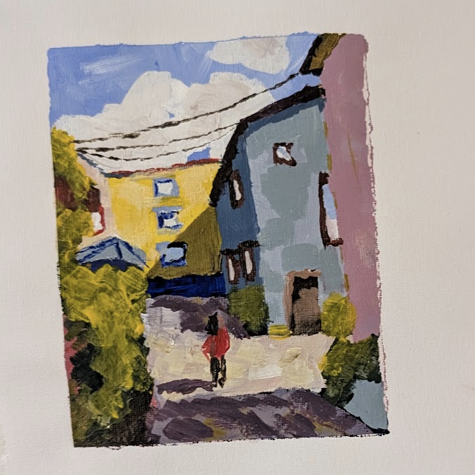

  
  

I'm a computer programmer from Ireland. I like creating things, whether that be with code, gardening, painting, or whatever other hobbies I pick up and put down when I get board, but this site is mostly about software. 

I think software should be more colourful, warm, fun, predictable, and have a little bit of social good in the world. In the world of fast AI software development I think side projects are a wonderful way to get detail orientated again. 

Feel free to get in touch!

  

Posts

<ul class="embedded blog-posts">
  <li data-tags="Essay,Not-tech">
    <i><time datetime="2026-04-12T17:45Z">12 Apr, 2026</time></i>
    <a href="/how-to-commute/">Commuting</a>
  </li>
  <li data-tags="Not-tech,Note">
    <i><time datetime="2026-02-28T18:45Z">28 Feb, 2026</time></i>
    <a href="/aye/">Areas of Ireland where people say "aye"</a>
  </li>
  <li data-tags="Note">
    <i><time datetime="2025-12-28T08:30Z">28 Dec, 2025</time></i>
    <a href="/githooks/">Choose git pre-commit hooks over GitHub actions for personal projects</a>
  </li>
  <li data-tags="Release">
    <i><time datetime="2025-12-21T18:45Z">21 Dec, 2025</time></i>
    <a href="/fs2md/">fs2md: file system to markdown</a>
  </li>
  <li data-tags="Note">
    <i><time datetime="2025-04-19T17:45Z">19 Apr, 2025</time></i>
    <a href="/stateful-frontends/">Low effort durable state in personal apps</a>
  </li>
  <li data-tags="Release">
    <i><time datetime="2025-04-12T17:45Z">12 Apr, 2025</time></i>
    <a href="/urltodo/">urltodo</a>
  </li>
  <li data-tags="Tutorial">
    <i><time datetime="2025-03-24T18:45Z">24 Mar, 2025</time></i>
    <a href="/old-chrome-versions/">Easily download and run old Chrome versions</a>
  </li>
  <li data-tags="Note">
    <i><time datetime="2025-02-19T18:45Z">19 Feb, 2025</time></i>
    <a href="/js-build-times/">Low-Hanging Fruits of JS build and test times</a>
  </li>
  <li data-tags="Tutorial">
    <i><time datetime="2025-01-26T08:30Z">26 Jan, 2025</time></i>
    <a href="/aws-webapp-auth/">AWS Cognito and Amplify auth for React apps (without the Amplify CLI)</a>
  </li>
  <li data-tags="Release">
    <i><time datetime="2024-10-20T17:45Z">20 Oct, 2024</time></i>
    <a href="/tiny-calendar/">Tiny Calendar</a>
  </li>
  <li data-tags="Note">
    <i><time datetime="2024-10-11T17:45Z">11 Oct, 2024</time></i>
    <a href="/notesworkshop/">A note-taking app that you can program like Excel...</a>
  </li>
  <li data-tags="Release">
    <i><time datetime="2024-07-21T17:45Z">21 Jul, 2024</time></i>
    <a href="/mapguesser/">MapGuesser</a>
  </li>
  <li data-tags="Essay,Not-tech">
    <i><time datetime="2024-03-15T18:45Z">15 Mar, 2024</time></i>
    <a href="/job-hunting-2024/">Job hunting 2024</a>
  </li>
  <li data-tags="Note">
    <i><time datetime="2024-02-17T18:45Z">17 Feb, 2024</time></i>
    <a href="/how-to-commute-new/">Code quality and engineering practices checklist</a>
  </li>
  <li data-tags="Talk">
    <i><time datetime="2023-12-13T18:45Z">13 Dec, 2023</time></i>
    <a href="/build-tools/">Build your own tools</a>
  </li>
  <li data-tags="Essay,Not-tech">
    <i><time datetime="2023-11-12T18:45Z">12 Nov, 2023</time></i>
    <a href="/shiny-black-boxism/">Shiny Black Boxism</a>
  </li>
  <li data-tags="Talk">
    <i><time datetime="2023-10-05T17:45Z">05 Oct, 2023</time></i>
    <a href="/codespaces/">CodeSpaces: Beyond Local Dev</a>
  </li>
  <li data-tags="Release">
    <i><time datetime="2023-09-04T17:45Z">04 Sep, 2023</time></i>
    <a href="/promptmarker/">PromptMarker</a>
  </li>
  <li data-tags="Tutorial">
    <i><time datetime="2023-08-29T17:45Z">29 Aug, 2023</time></i>
    <a href="/notarize/">Notarizing Electron Apps for MacOS</a>
  </li>
  <li data-tags="Release">
    <i><time datetime="2023-07-28T17:45Z">28 Jul, 2023</time></i>
    <a href="/notes-dater/">Obsidian Notes Dater</a>
  </li>
  <li data-tags="Not-tech,Note">
    <i><time datetime="2023-06-13T17:45Z">13 Jun, 2023</time></i>
    <a href="/new-step/">The next step in my career</a>
  </li>
  <li data-tags="Release">
    <i><time datetime="2023-03-03T18:45Z">03 Mar, 2023</time></i>
    <a href="/time-tamer/">Time Tamer</a>
  </li>
  <li data-tags="Tutorial">
    <i><time datetime="2023-02-02T18:45Z">02 Feb, 2023</time></i>
    <a href="/electron-custom-icon/">Adding custom electron app icons on Mac</a>
  </li>
  <li data-tags="Tutorial">
    <i><time datetime="2022-07-23T17:45Z">23 Jul, 2022</time></i>
    <a href="/fix-mac-monitor/">MacBook secondary monitor not waking from sleep solved</a>
  </li>
  <li data-tags="Note">
    <i><time datetime="2021-09-21T17:45Z">21 Sep, 2021</time></i>
    <a href="/starting-serverless/">Starting with AWS and the Serverless Framework</a>
  </li>
  <li data-tags="Tutorial">
    <i><time datetime="2021-06-03T17:45Z">03 Jun, 2021</time></i>
    <a href="/local-outlier-factor/">Local outlier factor from scratch in Python</a>
  </li>
</ul>

